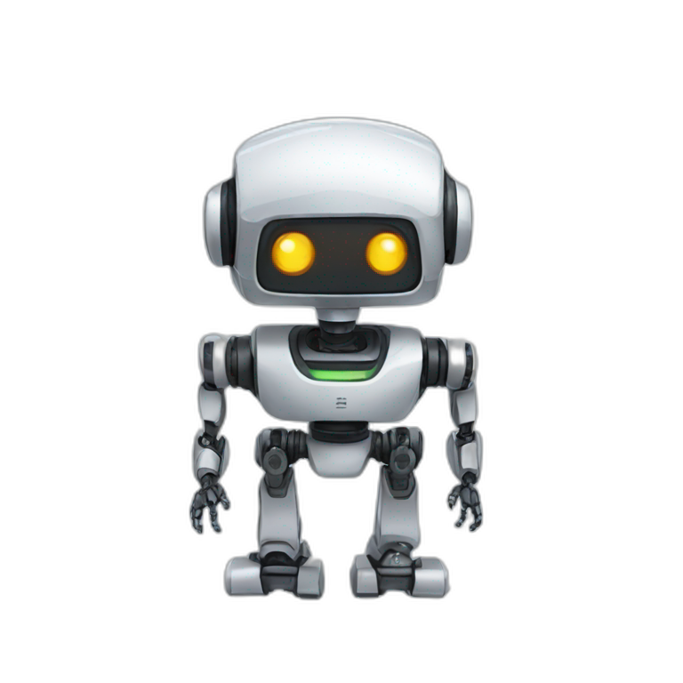

# 🚀 AI Education Platform

> An intelligent learning companion powered by artificial intelligence

| Core Features | Description |
|--------------|-------------|
| 🏠 **Home** | Your learning journey starts here |
| 🔐 **Login/Signup** | Join our knowledge community |
| 📊 **Dashboard** | Your personalized learning hub |
| 👤 **Profile** | Customize your learning experience |
| 🏆 **Leaderboards** | Compete and grow together |
| 🎯 **Achievement Badges** | Earn recognition |
| 🌟 **Progress Rankings** | Track your success |
| 🤝 **Friendly Challenges** | Learn through competition |
| 🎉 **Weekly Competitions** | Fun learning contests |
| 🤖 **AI Study Coach** | Real-time learning recommendations |
| 🧪 **Project Labs** | Hands-on project-based learning |
| 🎓 **Career Pathways** | AI-guided career development |
|  🎯🤖 **AI-Powered Smart Learning** | AI-driven personalized learning experience |

| Learning Assistants | Description |
|-------------------|-------------|
| 📚 **Study Hub** | Smart note-taking & flashcards |
| 🔢 **Calculator Suite** | Advanced math & science tools |
| ✍️ **Writing Assistant** | Essays & grammar support |
| 📝 **Homework Helper** | Intelligent assignment support |
| 🎯 **Adaptive Learning** | Personalized learning paths |
| 🧠 **Knowledge Gaps Detector** | AI-powered assessment |
| 🎓 **Study Pace Optimizer** | Smart scheduling system |

| Specialized Tools | Description |
|------------------|-------------|
| 🌐 **Language Lab** | Master new languages |
| 💻 **Code Academy** | Learn programming interactively |
| 🎨 **Creative Studio** | Explore art & music |
| 🔬 **Science Center** | Virtual labs & simulations |
| 📄 **Research Assistant** | Academic excellence tools |
| 🤖 **AI Tutor** | 24/7 personalized tutoring |
| 🎮 **Gamified Learning** | Educational games & quests |
| 🗣️ **Voice Learning** | Audio-based study tools |

| Community | Description |
|-----------|-------------|
| 💬 **Forums** | Connect with learners |
| 📚 **Resources** | Curated learning materials |
| 📰 **Blog** | Latest in EdTech |
| 🤝 **Peer Learning** | AI-matched study groups |
| 🏆 **Achievement System** | Smart progress tracking |

| Platform Info | Description |
|---------------|-------------|
| 👨‍💼 **Admin Portal** | Platform management |
| 📜 **Legal** | Terms & privacy |
| ❓ **Help Center** | Support & guidance |
| 📈 **Analytics** | Learning insights dashboard |

---
*Empowering education through AI innovation*

