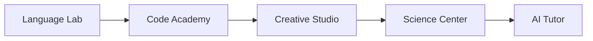

<h1 align="center">
     AI Education Platform
</h1>

    
    
    

    

    <i>An intelligent learning companion powered by artificial intelligence</i>

    
    [🏠 Home](/#) •
    [📚 Learn](/#) •
    [💡 Explore](/#) •
    [👥 Community](/#) •
    [📱 Download](/#)
    

## 🎯 Core Features

<table align="center">
    <tr>
        <td align="center"><b>🏠 Home</b></td>
        <td align="center"><b>🔐 Login</b></td>
        <td align="center"><b>📊 Dashboard</b></td>
        <td align="center"><b>👤 Profile</b></td>
    </tr>
    <tr>
        <td align="center"><b>🏆 Leaderboards</b></td>
        <td align="center"><b>🎯 Badges</b></td>
        <td align="center"><b>🌟 Rankings</b></td>
        <td align="center"><b>🤝 Challenges</b></td>
    </tr>
</table>

## 🤖 AI-Powered Learning

    

### 📚 Learning Assistants
- Study Hub with Smart Notes
- Advanced Calculator Suite  
- Intelligent Writing Assistant
- AI Homework Helper
- Adaptive Learning Paths
- Knowledge Gap Detection
- Smart Study Scheduling

### 🛠️ Specialized Tools

## 🌟 Community Features

    
| Feature | Description |
|---------|------------|
| 💬 Forums | Connect with learners |
| 📚 Resources | Curated materials |
| 📰 Blog | EdTech updates |
| 🤝 Peer Learning | AI study groups |

    <i>Empowering education through AI innovation</i>
      
    

